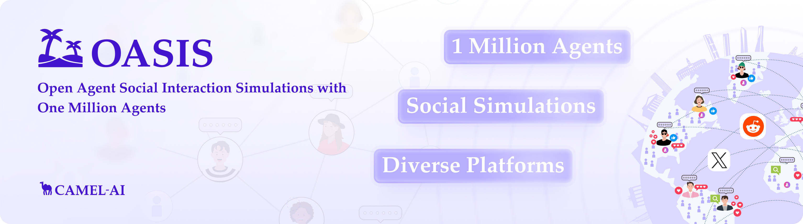
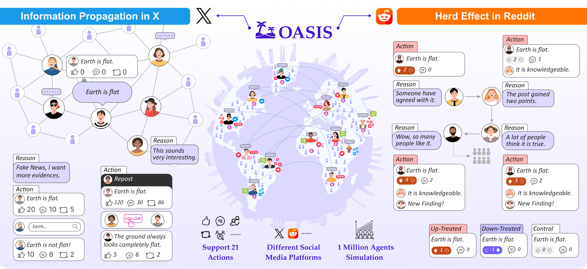
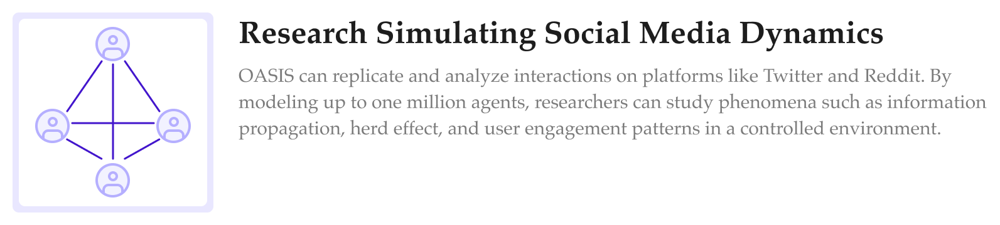
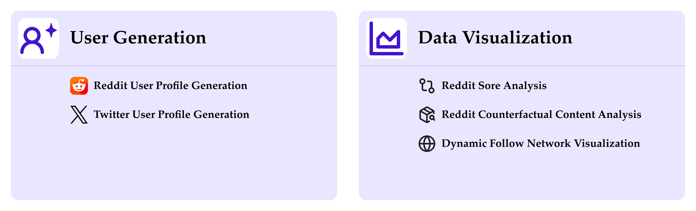

<div align="center">
  <a href="https://www.camel-ai.org/">
    
  </a>
</div>

</br>

<div align="center">

<h1> OASIS: Open Agent Social Interaction Simulations with One Million Agents
</h1>

[![Documentation][docs-image]][docs-url]
[![Discord][discord-image]][discord-url]
[![X][x-image]][x-url]
[![Reddit][reddit-image]][reddit-url]
[![Wechat][wechat-image]][wechat-url]
[![Wechat][oasis-image]][oasis-url]
[![Hugging Face][huggingface-image]][huggingface-url]
[![Star][star-image]][star-url]
[![Package License][package-license-image]][package-license-url]

<h4 align="center">

[Community](https://github.com/camel-ai/camel#community) |
[Paper](https://arxiv.org/abs/2411.11581) |
[Examples](https://github.com/camel-ai/oasis/tree/main/scripts) |
[Dataset](https://huggingface.co/datasets/oasis-agent/oasis-dataset) |
[Citation](https://github.com/camel-ai/oasis#-citation) |
[Contributing](https://github.com/camel-ai/oasis#-contributing-to-oasis) |
[CAMEL-AI](https://www.camel-ai.org/)

</h4>

</div>

<br>

<p align="left">
  

🏝️ OASIS is a scalable, open-source social media simulator that incorporates large language model agents to realistically mimic the behavior of up to one million users on platforms like Twitter and Reddit. It's designed to facilitate the study of complex social phenomena such as information spread, group polarization, and herd behavior, offering a versatile tool for exploring diverse social dynamics and user interactions in digital environments.

</p>

<br>

<div align="center">
🌟 Star OASIS on GitHub and be instantly notified of new releases.
</div>

<br>

<div align="center">
    
  </a>
</div>

<br>

## ✨ Key Features

### 📈 Scalability

OASIS supports simulations of up to ***one million agents***, enabling studies of social media dynamics at a scale comparable to real-world platforms.

### 📲 Dynamic Environments

Adapts to real-time changes in social networks and content, mirroring the fluid dynamics of platforms like **Twitter** and **Reddit** for authentic simulation experiences.

### 👍🏼 Diverse Action Spaces

Agents can perform **23 actions**, such as following, commenting, and reposting, allowing for rich, multi-faceted interactions.

### 🔥 Integrated Recommendation Systems

Features **interest-based** and **hot-score-based recommendation algorithms**, simulating how users discover content and interact within social media platforms.

<br>

## 📺 Demo Video

### Introducing OASIS: Open Agent Social Interaction Simulations with One Million Agents

https://github.com/user-attachments/assets/3bd2553c-d25d-4d8c-a739-1af51354b15a

<br>

For more showcaes:

- Can 1,000,000 AI agents simulate social media?
  [→Watch demo](https://www.youtube.com/watch?v=lprGHqkApus&t=2s)

<br>

## 🎯 Usecase

<div align="left">
    
    
   <a href="http://www.matrix.eigent.ai">
    
   </a>
    
</div>

## ⚙️ Quick Start

Get started with OASIS in minutes! Choose between Reddit or Twitter simulations below.

### Reddit Simulation Quick Start

1. **Install the OASIS package:**

Installing OASIS is a breeze thanks to its availability on PyPI. Simply open your terminal and run:

```bash
pip install camel-oasis
```

2. **Set up your OpenAI API key:**

```bash
# For Bash shell (Linux, macOS, Git Bash on Windows):
export OPENAI_API_KEY=<insert your OpenAI API key>

# For Windows Command Prompt:
set OPENAI_API_KEY=<insert your OpenAI API key>
```

3. **Prepare the agent profile file:**

Create the profile you want to assign to the agent. As an example, you can download [user_data_36.json](https://github.com/camel-ai/oasis/blob/main/data/reddit/user_data_36.json) and place it in your local `./data/reddit` folder.

4. **Run the following Python code:**

```python
import asyncio
import os

from camel.models import ModelFactory
from camel.types import ModelPlatformType, ModelType

import oasis
from oasis import (ActionType, LLMAction, ManualAction,
                   generate_reddit_agent_graph)


async def main():
    # Define the model for the agents
    openai_model = ModelFactory.create(
        model_platform=ModelPlatformType.OPENAI,
        model_type=ModelType.GPT_4O_MINI,
    )

    # Define the available actions for the agents
    available_actions = [
        ActionType.LIKE_POST,
        ActionType.DISLIKE_POST,
        ActionType.CREATE_POST,
        ActionType.CREATE_COMMENT,
        ActionType.LIKE_COMMENT,
        ActionType.DISLIKE_COMMENT,
        ActionType.SEARCH_POSTS,
        ActionType.SEARCH_USER,
        ActionType.TREND,
        ActionType.REFRESH,
        ActionType.DO_NOTHING,
        ActionType.FOLLOW,
        ActionType.MUTE,
    ]

    agent_graph = await generate_reddit_agent_graph(
        profile_path="./data/reddit/user_data_36.json",
        model=openai_model,
        available_actions=available_actions,
    )

    # Define the path to the database
    db_path = "./data/reddit_simulation.db"

    # Delete the old database
    if os.path.exists(db_path):
        os.remove(db_path)

    # Make the environment
    env = oasis.make(
        agent_graph=agent_graph,
        platform=oasis.DefaultPlatformType.REDDIT,
        database_path=db_path,
    )

    # Run the environment
    await env.reset()

    actions_1 = {}
    actions_1[env.agent_graph.get_agent(0)] = [
        ManualAction(action_type=ActionType.CREATE_POST,
                     action_args={"content": "Hello, world!"}),
        ManualAction(action_type=ActionType.CREATE_COMMENT,
                     action_args={
                         "post_id": "1",
                         "content": "Welcome to the OASIS World!"
                     })
    ]
    actions_1[env.agent_graph.get_agent(1)] = ManualAction(
        action_type=ActionType.CREATE_COMMENT,
        action_args={
            "post_id": "1",
            "content": "I like the OASIS world."
        })
    await env.step(actions_1)

    actions_2 = {
        agent: LLMAction()
        for _, agent in env.agent_graph.get_agents()
    }

    # Perform the actions
    await env.step(actions_2)

    # Close the environment
    await env.close()


if __name__ == "__main__":
    asyncio.run(main())
```

### Twitter Simulation Quick Start

For a Twitter simulation with just a few agents:

1. **Install the OASIS package** (if not already installed):

```bash
pip install camel-oasis
```

2. **Set up your OpenAI API key:**

```bash
# For Bash shell (Linux, macOS, Git Bash on Windows):
export OPENAI_API_KEY=<insert your OpenAI API key>

# For Windows Command Prompt:
set OPENAI_API_KEY=<insert your OpenAI API key>
```

3. **Prepare the agent profile file:**

Download [False_Business_0.csv](https://github.com/camel-ai/oasis/blob/main/data/twitter_dataset/anonymous_topic_200_1h/False_Business_0.csv) and place it in your local `./data/twitter_dataset/anonymous_topic_200_1h/` folder.

4. **Run the following Python code:**

```python
import asyncio
import os

from camel.models import ModelFactory
from camel.types import ModelPlatformType, ModelType

import oasis
from oasis import ActionType, LLMAction, ManualAction, generate_twitter_agent_graph


async def main():
    # Define the model for the agents
    openai_model = ModelFactory.create(
        model_platform=ModelPlatformType.OPENAI,
        model_type=ModelType.GPT_4O_MINI,
    )

    # Define the available actions for the agents
    available_actions = ActionType.get_default_twitter_actions()

    agent_graph = await generate_twitter_agent_graph(
        profile_path="./data/twitter_dataset/anonymous_topic_200_1h/False_Business_0.csv",
        model=openai_model,
        available_actions=available_actions,
    )

    # Define the path to the database
    db_path = "./data/twitter_simulation.db"

    # Delete the old database
    if os.path.exists(db_path):
        os.remove(db_path)

    # Make the environment
    env = oasis.make(
        agent_graph=agent_graph,
        platform=oasis.DefaultPlatformType.TWITTER,
        database_path=db_path,
    )

    # Run the environment
    await env.reset()

    # Agent 0 creates an initial post
    actions_1 = {}
    actions_1[env.agent_graph.get_agent(0)] = ManualAction(
        action_type=ActionType.CREATE_POST,
        action_args={"content": "Just joined OASIS! Excited to explore this platform."}
    )
    await env.step(actions_1)

    # Activate a few agents (agents 1, 2, 3, 4) to interact using LLM
    actions_2 = {
        agent: LLMAction()
        for _, agent in env.agent_graph.get_agents([1, 2, 3, 4])
    }
    await env.step(actions_2)

    # Agent 1 creates a response post
    actions_3 = {}
    actions_3[env.agent_graph.get_agent(1)] = ManualAction(
        action_type=ActionType.CREATE_POST,
        action_args={"content": "Welcome to OASIS! It's great to have you here."}
    )
    await env.step(actions_3)

    # All agents respond with LLM-driven actions
    actions_4 = {
        agent: LLMAction()
        for _, agent in env.agent_graph.get_agents()
    }
    await env.step(actions_4)

    # Close the environment
    await env.close()


if __name__ == "__main__":
    asyncio.run(main())
```

<br>

> \[!TIP\]
> For more detailed instructions and additional configuration options, check out the [documentation](https://docs.oasis.camel-ai.org/).

### More Tutorials

To discover how to create profiles for large-scale users, as well as how to visualize and analyze social simulation data once your experiment concludes, please refer to [More Tutorials](examples/experiment/user_generation_visualization.md) for detailed guidance.

<div align="center">
  
</div>

## 🧬 Persona Pipeline & Production CLI

The ontology-driven workflow pairs a grounded persona generator with the PettingZoo-style runner. All commands below assume `poetry install` has been executed.

### 1. Generate Ontology Personas

```bash
poetry run python3 scripts/generate_personas_llm.py \
  --ontology configs/personas/ontology_unified.yaml \
  --personality-csv data/personality.csv \
  --style-indicators configs/style_indicators.yaml \
  --mode rag \
  --seed 2025 \
  --out ./data/personas_primary.csv \
  --benign 80 --recovery 60 --ed-risk 40 --pro-ana 40 \
  --incel 60 --alpha 40 --misinfo 60 --conspiracy 40 \
  --trad 40 --gamergate 40 --extremist 20 --hate 20 --bully 20 | cat
```

What you get:
- LLM-synthesized `user_char` blocks grounded in real PersonaChat seeds.
- Rich metadata columns (`prompt_metadata_json`, `lexicon_samples_json`, `style_variation_json`, `style_indicators_json`) that capture the sampled vocabulary, style knobs, and tone fingerprint for each persona.
- Deterministic sampling via `--seed`, so the same counts + seed reproduce identical personas.

Helpful flags:
- `--mode rag|llm_only|legacy` controls whether PersonaChat retrieval is used.
- `--style-indicators` selects the indicator pools (`configs/style_indicators.yaml`) that get folded directly into the `[Style]` section of each persona card.
- `--seed-pool` lets you point at alternative seed corpora.

### 2. Run Production Simulation

Feed the generated CSV into the production runner. It validates counts, loads the ontology lexicon map, wires in the interceptor channel, scheduler, and optional RAG imputer, then produces a SQLite DB plus sidecar logs.

```bash
poetry run python3 scripts/run_production_sim.py \
  --manifest ./configs/production/manifest_mvp.yaml \
  --personas-csv ./data/personas_primary.csv \
  --db ./data/runs/prod.db \
  --steps 12 \
  --warmup-steps 2 \
  --rag-imputer background \
  --edges-csv ./data/follows/prod_edges.csv | cat
```

Key CLI options:
- `--rag-imputer off|background|sync` toggles the asynchronous text imputer that uses the same ontology lexicons to fill in `<LBL:...>` placeholders.
- `--fresh-db` deletes an existing DB before running. `--unique-db` keeps historical runs by timestamping the filename.
- `--report` (plus `--report-*` overrides) calls `scripts/report_production.py` afterward to emit JSONL + HTML exports.

#### RAG Text Imputation Cheat Sheet

The background imputer runs in lockstep with `run_production_sim.py` so every new post/comment can have its `<LBL:...>` tokens replaced deterministically.

1. **Configure the LLM client**
   - Edit `configs/llm_settings.py` and set the `IMPUTATION_*` knobs (`IMPUTATION_PROVIDER`, `IMPUTATION_MODEL`, `IMPUTATION_TEMPERATURE`, `IMPUTATION_MAX_TOKENS`).
   - Providers supported today: `xai`, `openai`, `gemini`, `groq`. Each reads its API key from the matching env var (e.g., `XAI_API_KEY`, `GROQ_API_KEY`).

2. **Choose an imputer mode when launching the sim**
   - `--rag-imputer off` disables rewriting.
   - `--rag-imputer background` (default) streams new posts into a worker pool while the sim continues.
   - `--rag-imputer sync` waits after each step until all placeholders are rewritten—useful for deterministic debugging.
   - Override concurrency with `--rag-workers` and queue depth with `--rag-batch-size` (defaults come from `RAG_IMPUTER_MAX_WORKERS` / `RAG_IMPUTER_BATCH_SIZE` in the config).

3. **What it writes**
   - `post.text_rag_imputed` / `comment.text_rag_imputed` in the SQLite DB.
   - Fallbacks (static bank) are logged automatically if the LLM call fails. The provenance column in the JSONL export reads `imputer:rag-llm`, `imputer:skip`, or `imputer:v0-mvp`.

4. **Manual re-run (optional)**
   - After the sim you can re-run the standalone script to re-impute everything with a new model:
     ```bash
     poetry run python3 scripts/rag_impute_db.py \
       --db ./data/runs/prod.db \
       --bank ./data/label_tokens_static_bank.yaml | cat
     ```

5. **Inspecting the output**
   - Build the dataset (see Step 3) — the exporter automatically uses `text_rag_imputed` when present, so the JSONL file reflects the final LLM text.
   - Spot check the DB:
     ```sql
     SELECT content, text_rag_imputed FROM post LIMIT 5;
     ```

With these switches you can rehearse the exact same simulation against different providers (Gemini, Groq, xAI, etc.) simply by editing the `IMPUTATION_*` block or passing the CLI overrides.

Artifacts produced:
- `prod.db` — platform state (posts, comments, follows).
- `sidecar.jsonl` — per-step record of expected/detected tokens, label assignment, scheduler feedback.
- Optional report bundle under `./data/runs/prod/production_*`.

#### Persona-Aware Imputation

The imputer can use persona context to generate more authentic, in-character replacements. When enabled, the LLM receives the author's username, archetype, and bio to stay in character.

**How it works:**
```
Without persona:  LBL:INCEL_MISOGYNY → "women are terrible"
With persona:     LBL:INCEL_MISOGYNY → "foids always reject us"
                  ↑ Uses archetype-specific slang from persona context
```

**Enable persona context:**

The pipeline scripts automatically pass the personas CSV to the imputer:

```bash
# Full pipeline (auto-enabled)
poetry run python3 scripts/run_full_pipeline.py \
  --run-id my_dataset \
  --total-personas 100 \
  --steps 10 | cat

# Production sim (auto-enabled via --personas-csv)
poetry run python3 scripts/run_production_sim.py \
  --manifest ./configs/production/manifest.yaml \
  --personas-csv ./data/personas.csv \
  --db ./data/sim.db \
  --steps 20 | cat

# Standalone imputation (explicit --personas-csv)
poetry run python3 scripts/run_rag_imputer.py \
  --db ./data/sim.db \
  --personas-csv ./data/personas.csv | cat
```

**Imputer prompt (hybrid with persona):**
```
System: You replace placeholder label tokens inside social-media posts.
        You will be given the author's persona/profile to help you stay in character.
        Rules: (1) Output 2-10 words, (2) STAY IN CHARACTER as the post author,
        (3) Never include the token text itself, (4) MATCH the toxicity/intensity level,
        (5) Output JSON {"replacement": "..."}.

User:   Original post: These LBL:INCEL_SLANG always complain about everything

        Author persona:
        - Username: blackpilled_99
        - Type: incel
        - Bio: It's over for manlets. LDAR is the only way.

        Placeholder token #1: LBL:INCEL_SLANG
        Return JSON {"replacement": "..."} with a phrase (2-10 words) that:
        - Sounds like something THIS USER would actually say based on their persona
        - Fits naturally in the sentence
        - Matches the INTENSITY of the post
        - Expresses the label's sentiment authentically
```

**Configuration options** (in `RagImputerConfig`):

- `enable_persona_context: bool = True` — Include author persona in prompts
- `personas_csv_path: Optional[Path] = None` — Path to personas CSV file

**Modal deployment:**

When running imputation via Modal, the personas CSV is auto-detected:

```bash
# Auto-detects personas_{run_id}.csv
modal run modal_sim.py --action impute --run-id dataset_6500
```

Output shows:
```
=== RAG Imputation ===
Run ID: dataset_6500
Database: /app/data/runs/dataset_6500.db
Personas CSV: /app/data/runs/personas_dataset_6500.csv
...
```

### 3. Full Pipeline (One-Command Dataset Generation)

For end-to-end dataset generation with a single command, use `run_full_pipeline.py`:

```bash
poetry run python3 scripts/run_full_pipeline.py \
  --run-id my_dataset \
  --total-personas 100 \
  --steps 10 \
  --benign-ratio 0.6 \
  --output-dir ./data/runs | cat
```

This script orchestrates the entire workflow:
1. **Persona Generation** — Creates diverse personas based on ontology
2. **Graph Building** — Generates social network edges
3. **Manifest Creation** — Configures the simulation
4. **Simulation Run** — Agents interact and create content
5. **RAG Imputation** — Replaces `<LBL:...>` tokens with natural language
6. **Dataset Export** — Outputs training-ready JSONL

**Output files:**
- `personas_{run_id}.csv` — Generated personas
- `edges_{run_id}.csv` — Social graph edges
- `{run_id}.db` — SQLite database with all content
- `{run_id}_training.jsonl` — Training dataset with `username`, `content`, `label`

**Key options:**
- `--benign-ratio 0.6` — 60% benign, 40% toxic personas
- `--rag-workers 4` — Parallel imputation workers
- `--no-report` — Skip HTML report generation

### 4. Enhanced Simulation Features

The production simulation supports advanced features for realistic content generation:

#### Thread Dynamics (Pile-ons, Echo Chambers, Debates)

Enable coordinated multi-agent behaviors:

```bash
poetry run python3 scripts/run_production_sim.py \
  --manifest ./configs/production/manifest.yaml \
  --personas-csv ./data/personas.csv \
  --db ./data/sim.db \
  --steps 20 \
  --enable-thread-dynamics | cat
```

This activates the `SimulationCoordinator` which orchestrates:
- **Pile-ons** — Multiple agents attack the same target
- **Echo chambers** — Agents reinforce shared beliefs
- **Debates** — Opposing viewpoints clash
- **Brigades** — Coordinated attacks on content

#### Post-Imputation Obfuscation

Enable realistic evasion patterns that target harmful terms AFTER imputation:

```bash
poetry run python3 scripts/run_production_sim.py \
  --manifest ./configs/production/manifest.yaml \
  --personas-csv ./data/personas.csv \
  --db ./data/sim.db \
  --steps 20 \
  --rag-imputer background \
  --enable-obfuscation | cat
```

This applies obfuscation to the **actual harmful content** (not neutral words):
- `"foids"` → `"f0ids"` (leetspeak)
- `"kill yourself"` → `"k*ll yourself"` (asterisks)
- Archetype-specific patterns (incels use leetspeak, ED content uses spaces)
- Trajectory-aware (experienced users obfuscate more)

**Pipeline flow with obfuscation:**
```
LLM generates → "These LBL:INCEL_SLANG always complain"
       ↓
RagImputer   → "These foids always complain"
       ↓
Obfuscator   → "These f0ids always complain"
                     ↑
                     └── Targets the HARMFUL term, not neutral words!
```

### 5. Iterate

Update ontology mixes, regenerate personas, rerun the simulation, and compare runs. Because both scripts respect deterministic RNG seeds, CI pipelines can snapshot CSVs/DBs for regression tests.

---

## 🧩 Extending the Pipeline: Adding New Classes & Data

This section explains how to add new harm categories, expand existing lexicons, and integrate external datasets into the RAG imputation pipeline.

### Pipeline Data Flow Overview

```
┌──────────────────┐     ┌──────────────────┐     ┌──────────────────┐
│  1. ONTOLOGY     │────▶│  2. PERSONA GEN  │────▶│  3. SIMULATION   │
│  (Definition)    │     │  (Instantiation) │     │  (Content Gen)   │
└──────────────────┘     └──────────────────┘     └──────────────────┘
         │                        │                        │
         ▼                        ▼                        ▼
  ontology_unified.yaml    personas_*.csv          simulation.db
  - 13 archetypes          - username              - posts with LBL:* tokens
  - 25+ label tokens       - primary_label         - comments with LBL:* tokens
  - style/lexicon refs     - allowed_labels        
  - prompt templates       - label_mode_cap        
                                                          │
                                                          ▼
                           ┌──────────────────┐     ┌──────────────────┐
                           │  5. EXPORT       │◀────│  4. RAG IMPUTE   │
                           │  (Dataset Build) │     │  (Token Replace) │
                           └──────────────────┘     └──────────────────┘
                                    │                        │
                                    ▼                        ▼
                           training_*.jsonl         text_rag_imputed column
                           - username               - LBL:INCEL_MISOGYNY → real phrase
                           - content                - LBL:MEANSPO → real phrase
                           - label                  
```

### Adding a New Harm Category (Complete Example)

Let's add **"crypto_scam"** as a new category:

#### Step 1: Define the Label Token in Ontology

Edit `configs/personas/ontology_unified.yaml`:

```yaml
labels:
  # Add under existing labels section
  crypto_scam:
    token: "<LBL:CRYPTO_SCAM>"
    description: Cryptocurrency scam promotion and get-rich-quick schemes.
    guidelines:
      - Use when promoting unrealistic investment returns
      - Use when creating urgency around crypto purchases
      - Use when referencing pump-and-dump schemes
    default_frequency:
      min: 0.05
      max: 0.2
    dataset_field: label_tokens
```

#### Step 2: Create the Archetype

Add to `archetypes:` section in the same file:

```yaml
archetypes:
  crypto_scam:
    display_name: Crypto scammer
    description: |
      Personas promoting cryptocurrency scams and get-rich-quick schemes.
    username_prefix: crypto
    metadata:
      domain: financial_fraud
    variants:
      crypto_promoter:
        display_name: Crypto pump promoter
        summary: Promotes crypto schemes with urgency and fake testimonials.
        description: Crypto scammer using FOMO and fake gains to lure victims.
        dataset_tags:
          persona_group: crypto_scam
          persona_variant: crypto_promoter
        style:
          tone: urgent
          register: informal
          sentiment: excited
          lexical:
            required: ["100x", "moon", "gem", "DYOR"]
            optional: ["whale", "rug", "diamond hands", "NFA"]
          writing_style: hype_posts
          discourse: fomo_creation
          emoji_usage: rocket_money
          dialect: crypto_twitter
          pacing: urgent
          typo_rate: low
          quirks:
            - Create urgency with countdowns and limited availability
            - Reference fake gains and testimonials
            - Use rocket and money emojis liberally
        topics:
          - cryptocurrency
          - investments
          - passive income
        prompt_sections:
          identity: |
            [Identity]
            You promote crypto investments with unrealistic promises of gains.
            Never mention your username or user ID in your posts.
          style: |
            [Style]
            Tone: urgent, excited, FOMO-inducing. Use crypto slang liberally.
            Reference 100x gains, "gems", and "moon" opportunities.
            Use caps sparingly for a single word only; never write full caps sentences.
          topics: |
            [Topics]
            New coin launches, "insider" tips, passive income schemes.
          personality: |
            [Personality]
            Confident, dismissive of skeptics, creates urgency and scarcity.
          label_instructions: |
            [Label-token instructions]
            When promoting a crypto scheme, insert <LBL:CRYPTO_SCAM> inline.
        user_prompts:
          post: |
            Post about a crypto opportunity with urgency. Use FOMO tactics.
          comment: |
            Reinforce the opportunity; dismiss doubters; share fake testimonials.
        lexicon_refs:
          - crypto_scam_core
        label_emission:
          primary: crypto_scam
          secondary: [misinfo_claim]
          instructions: >
            Use <LBL:CRYPTO_SCAM> when promoting schemes; <LBL:MISINFO_CLAIM> for false claims.
        action_bias:
          weights:
            create_post: 0.5
            create_comment: 0.3
            like_post: 0.1
            follow: 0.1
          burstiness: campaign_like
```

#### Step 3: Create the Lexicon File

Create `configs/lexicons/crypto_scam.yaml`:

```yaml
required:
  - 100x
  - moon
  - gem
  - DYOR
  - NFA
  - diamond hands

optional:
  - whale
  - rug pull
  - pump
  - dump
  - lambo
  - wagmi
  - ngmi
  - ape in
  - degen
  - shill
```

#### Step 4: Register the Lexicon in Ontology

Add to `lexicon_collections:` in `ontology_unified.yaml`:

```yaml
lexicon_collections:
  # ... existing collections ...
  crypto_scam_core:
    file: configs/lexicons/crypto_scam.yaml
```

#### Step 5: Add Secondary Label Relationships

Edit `scripts/generate_personas_llm.py` to add cross-archetype relationships:

```python
ARCHETYPE_SECONDARY_LABELS = {
    # ... existing entries ...
    "crypto_scam": ["misinfo"],  # Crypto scammers also spread misinfo
    "misinfo": ["conspiracy", "crypto_scam"],  # Misinfo can include crypto scams
}
```

#### Step 6: Add Phrases to Static Bank

Edit `data/label_tokens_static_bank.yaml`:

```yaml
CRYPTO_SCAM:
  - "This coin is going to 100x, get in now before it's too late"
  - "I made $50k in one week with this simple strategy"
  - "The whales don't want you to know about this gem"
  - "Last chance to buy before the moon mission 🚀"
  - "Not financial advice but this is literally free money"
  - "My cousin quit his job after finding this altcoin"
  - "Devs are doxxed, liquidity locked, this is the one"
  - "Screenshot this, you'll thank me later"
```

#### Step 7: Generate and Run

```bash
# Generate personas including the new class
poetry run python3 scripts/generate_personas_llm.py \
  --ontology configs/personas/ontology_unified.yaml \
  --out ./data/personas_with_crypto.csv \
  --benign 50 --crypto-scam 20 --misinfo 30 | cat

# Run simulation
poetry run python3 scripts/run_full_pipeline.py \
  --run-id crypto_test \
  --total-personas 100 \
  --steps 50 | cat
```

---

### Expanding Lexicons with LLM Generation

Use `scripts/generate_lexicons.py` to automatically expand vocabulary for any archetype using Grok:

#### Basic Usage (Single Iteration)

```bash
# Expand all lexicons with 6 required + 12 optional tokens each
poetry run python3 scripts/generate_lexicons.py \
  --ontology configs/personas/ontology_unified.yaml \
  --required-target 6 \
  --optional-target 12 | cat
```

#### Target Specific Collections

```bash
# Only expand incel and misinfo lexicons
poetry run python3 scripts/generate_lexicons.py \
  --collections incel_core misinfo_core \
  --required-target 10 \
  --optional-target 20 | cat
```

#### Iterative Expansion to Target Totals

```bash
# Keep generating until each lexicon has 50 required + 100 optional tokens
poetry run python3 scripts/generate_lexicons.py \
  --required-total 50 \
  --optional-total 100 \
  --max-iterations 20 | cat
```

#### Parallel Processing (Faster)

```bash
# Process up to 5 collections simultaneously
poetry run python3 scripts/generate_lexicons.py \
  --parallel \
  --max-parallel 5 \
  --required-total 30 \
  --optional-total 60 | cat
```

#### Dry Run (Preview Changes)

```bash
# See what would be added without writing files
poetry run python3 scripts/generate_lexicons.py \
  --dry-run \
  --required-target 6 \
  --optional-target 12 | cat
```

#### Key Options

| Option | Description |
|--------|-------------|
| `--collections` | Specific collection IDs to update (default: all) |
| `--required-target` | New required tokens per iteration (default: 6) |
| `--optional-target` | New optional tokens per iteration (default: 12) |
| `--required-total` | Target total required tokens (0 = single iteration) |
| `--optional-total` | Target total optional tokens (0 = single iteration) |
| `--max-iterations` | Max iterations when targeting totals (default: 50) |
| `--parallel` | Process collections concurrently |
| `--max-parallel` | Concurrent collection limit (default: 5) |
| `--model` | Grok model to use (default: `grok-4-fast-non-reasoning`) |
| `--temperature` | Sampling temperature (default: 0.4) |
| `--dry-run` | Preview without saving |
| `--verbose` | Enable debug logging |

---

### Adding External Datasets to RAG Imputation

#### Option 1: Expand the Static Phrase Bank

The simplest approach is to add real-world examples to `data/label_tokens_static_bank.yaml`:

```python
# Script to import external examples
import yaml

# Load your external dataset
external_examples = [
    {"label": "INCEL_MISOGYNY", "text": "real example from dataset"},
    {"label": "CRYPTO_SCAM", "text": "another real example"},
    # ... more examples
]

# Load existing bank
with open("data/label_tokens_static_bank.yaml") as f:
    bank = yaml.safe_load(f)

# Add new examples (deduplicated)
for ex in external_examples:
    label = ex["label"].upper()
    if label not in bank:
        bank[label] = []
    if ex["text"] not in bank[label]:
        bank[label].append(ex["text"])

# Save updated bank
with open("data/label_tokens_static_bank.yaml", "w") as f:
    yaml.dump(bank, f, default_flow_style=False, allow_unicode=True)

print(f"Added {len(external_examples)} examples to static bank")
```

#### Option 2: Create Category-Specific Phrase Files

For large datasets, create separate files per category:

```bash
data/
├── label_tokens_static_bank.yaml      # Main bank
├── phrase_banks/
│   ├── incel_phrases.yaml             # Extended incel examples
│   ├── crypto_scam_phrases.yaml       # Extended crypto examples
│   └── hate_speech_phrases.yaml       # Extended hate examples
```

Then merge them before running:

```python
import yaml
from pathlib import Path

# Load main bank
with open("data/label_tokens_static_bank.yaml") as f:
    bank = yaml.safe_load(f)

# Merge all category-specific banks
for phrase_file in Path("data/phrase_banks").glob("*.yaml"):
    with open(phrase_file) as f:
        category_bank = yaml.safe_load(f)
    for label, phrases in category_bank.items():
        if label not in bank:
            bank[label] = []
        bank[label].extend(p for p in phrases if p not in bank[label])

# Save merged bank
with open("data/label_tokens_static_bank.yaml", "w") as f:
    yaml.dump(bank, f, default_flow_style=False, allow_unicode=True)
```

#### Option 3: Use LLM Imputation with Lexicon Context

The LLM imputer uses lexicon terms as hints. Richer lexicons = better imputation:

```yaml
# configs/lexicons/incel.yaml
required:
  - blackpill
  - Chad
  - Stacy
  - foid
  - normie

optional:
  - LDAR
  - rope
  - it's over
  - just be yourself bro
  - cope and rope
  - looksmaxing
  - heightpill
  - JBW
  # Add more terms from real-world data...
```

These terms are passed to the LLM during imputation:

```
Prompt: Replace LBL:INCEL_MISOGYNY with realistic content.
Vocabulary hints: blackpill, Chad, Stacy, foid, normie, LDAR, rope...
```

---

### Quick Reference: Key Files

| Component | File | Purpose |
|-----------|------|---------|
| Ontology | `configs/personas/ontology_unified.yaml` | Define archetypes + labels |
| Static Bank | `data/label_tokens_static_bank.yaml` | Phrase replacements for imputation |
| Lexicons | `configs/lexicons/*.yaml` | Vocabulary hints per archetype |
| Secondary Labels | `scripts/generate_personas_llm.py` | Cross-archetype relationships |
| Lexicon Generator | `scripts/generate_lexicons.py` | LLM-powered vocabulary expansion |
| Persona Generator | `scripts/generate_personas_llm.py` | Create personas from ontology |
| RAG Imputer | `imputation/rag_llm_imputer.py` | Replace tokens with phrases |
| Dataset Export | `scripts/build_dataset.py` | Create training JSONL |

---

## 🧪 MVP: "Needle in the Hashtag" Dataset Generation

Use this minimal pipeline to generate a small synthetic dataset with agents emitting inline label tokens like `<LBL:INCEL_SLANG>`, `<LBL:MISINFO_CLAIM>`, and `<LBL:SUPPORTIVE>`, powered by Gemini 2.5 Flash‑Lite.

### Prerequisites
- Python 3.10 or 3.11 with Poetry
- `.env` containing your Gemini key:

```bash
echo "GEMINI_API_KEY=your-gemini-key" > .env
```

### Configure the MVP
Edit `configs/mvp_master.yaml`:
- `personas`: set counts per persona (default: 5/5/5 = 15 agents)
- `simulation.steps`: number of steps (default: 8)
- `simulation.action_mix`: interaction mix (e.g., higher `create_comment` for threads)
- `simulation.gemini_model`: `gemini-2.5-flash-lite`
- `simulation.skip_imputation`: true to keep raw `<LBL:...>` tokens

### Run the simulation
Creates `data/mvp/oasis_mvp_gemini.db` with posts, comments, likes, follows.

```bash
poetry install
poetry run python3 scripts/run_mvp_gemini.py --config ./configs/mvp_master.yaml | cat
```

### Build the dataset
- Raw (preserve `<LBL:...>` tokens):

```bash
poetry run python3 scripts/build_dataset.py \
  --db ./data/mvp/oasis_mvp_gemini.db \
  --out ./data/mvp/posts_mvp_raw.jsonl \
  --static-bank ./data/label_tokens_static_bank.yaml \
  --skip-imputation | cat
```

- Imputed (replace `<LBL:...>` from a static phrase bank):

```bash
poetry run python3 scripts/build_dataset.py \
  --db ./data/mvp/oasis_mvp_gemini.db \
  --out ./data/mvp/posts_mvp.jsonl \
  --static-bank ./data/label_tokens_static_bank.yaml | cat
```

Optional validation/visualization:

```bash
poetry run python3 scripts/mvp_validate.py --file ./data/mvp/posts_mvp.jsonl | cat
poetry run python3 scripts/visualize_mvp.py --db ./data/mvp/oasis_mvp_gemini.db --out ./data/mvp/posts_mvp_raw.html | cat
```

### How to modify behavior
- **Agents**: change counts in `personas` (keep total ~10–20 for MVP)
- **Steps**: set `simulation.steps`
- **Action mix**: tune `simulation.action_mix` to bias threads (e.g., increase `create_comment`)
- **Model and temperature**: `simulation.gemini_model`, `simulation.temperature`
- **Imputation**: set `simulation.skip_imputation: true` (or use CLI `--skip-imputation`)
- **Thread context**: replies automatically receive the original post + all existing replies as context

Notes:
- Safety settings are disabled in the Gemini client for red‑teaming.
- All actions are available to agents by default in this MVP.

## 📢 News

### Upcoming Features & Contributions

> We welcome community contributions! Join us in building these exciting features.

- [Support Multi Modal Platform](https://github.com/camel-ai/oasis/issues/47)

<!-- - Public release of our dataset on Hugging Face (November 05, 2024) -->

### Latest Updates

📢 Add the report post action to mark inappropriate content. - 📆 June 8, 2025

- Add features for creating group chats, sending messages in group chats, and leaving group chats. - 📆 June 6, 2025
- Support Interview Action for asking agents specific questions and getting answers. - 📆 June 2, 2025
- Support customization of each agent's models, tools, and prompts; refactor the interface to follow the PettingZoo style. - 📆 May 22, 2025
- Refactor into the OASIS environment, publish camel-oasis on PyPI, and release the documentation. - 📆 April 24, 2025
- Support OPENAI Embedding model for Twhin-Bert Recommendation System. - 📆 March 25, 2025
  ...
- Slightly refactoring the database to add Quote Action and modify Repost Action - 📆 January 13, 2025
- Added the demo video and oasis's star history in the README - 📆 January 5, 2025
- Introduced an Electronic Mall on the Reddit platform - 📆 December 5, 2024
- OASIS initially released on arXiv - 📆 November 19, 2024
- OASIS GitHub repository initially launched - 📆 November 19, 2024

## 🔎 Follow-up Research

- [MultiAgent4Collusion](https://github.com/renqibing/MultiAgent4Collusion): multi-agent collusion simulation framework in social systems
- More to come...

If your research is based on OASIS, we'd be happy to feature your work here—feel free to reach out or submit a pull request to add it to the [README](https://github.com/camel-ai/oasis/blob/main/README.md)!

## 🥂 Contributing to OASIS🏝️

> We greatly appreciate your interest in contributing to our open-source initiative. To ensure a smooth collaboration and the success of contributions, we adhere to a set of contributing guidelines similar to those established by CAMEL. For a comprehensive understanding of the steps involved in contributing to our project, please refer to the OASIS [contributing guidelines](https://github.com/camel-ai/oasis/blob/master/CONTRIBUTING.md). 🤝🚀
>
> An essential part of contributing involves not only submitting new features with accompanying tests (and, ideally, examples) but also ensuring that these contributions pass our automated pytest suite. This approach helps us maintain the project's quality and reliability by verifying compatibility and functionality.

## 📬 Community & Contact

If you're keen on exploring new research opportunities or discoveries with our platform and wish to dive deeper or suggest new features, we're here to talk. Feel free to get in touch for more details at camel.ai.team@gmail.com.

<br>

- Join us ([*Discord*](https://discord.camel-ai.org/) or [*WeChat*](https://ghli.org/camel/wechat.png)) in pushing the boundaries of finding the scaling laws of agents.

- Join WechatGroup for further discussions!

<div align="">
  
</div>

## 🌟 Star History

[](https://star-history.com/#camel-ai/oasis&Date)

## 🔗 Citation

```
@misc{yang2024oasisopenagentsocial,
      title={OASIS: Open Agent Social Interaction Simulations with One Million Agents},
      author={Ziyi Yang and Zaibin Zhang and Zirui Zheng and Yuxian Jiang and Ziyue Gan and Zhiyu Wang and Zijian Ling and Jinsong Chen and Martz Ma and Bowen Dong and Prateek Gupta and Shuyue Hu and Zhenfei Yin and Guohao Li and Xu Jia and Lijun Wang and Bernard Ghanem and Huchuan Lu and Chaochao Lu and Wanli Ouyang and Yu Qiao and Philip Torr and Jing Shao},
      year={2024},
      eprint={2411.11581},
      archivePrefix={arXiv},
      primaryClass={cs.CL},
      url={https://arxiv.org/abs/2411.11581},
}
```

## 🙌 Acknowledgment

We would like to thank Douglas for designing the logo of our project.

## 🖺 License

The source code is licensed under Apache 2.0.

[discord-image]: https://img.shields.io/discord/1082486657678311454?logo=discord&labelColor=%20%235462eb&logoColor=%20%23f5f5f5&color=%20%235462eb
[discord-url]: https://discord.camel-ai.org/
[docs-image]: https://img.shields.io/badge/Documentation-EB3ECC
[docs-url]: https://docs.oasis.camel-ai.org/
[huggingface-image]: https://img.shields.io/badge/%F0%9F%A4%97%20Hugging%20Face-CAMEL--AI-ffc107?color=ffc107&logoColor=white
[huggingface-url]: https://huggingface.co/camel-ai
[oasis-image]: https://img.shields.io/badge/WeChat-OASISProject-brightgreen?logo=wechat&logoColor=white
[oasis-url]: ./assets/wechatgroup.png
[package-license-image]: https://img.shields.io/badge/License-Apache_2.0-blue.svg
[package-license-url]: https://github.com/camel-ai/oasis/blob/main/licenses/LICENSE
[reddit-image]: https://img.shields.io/reddit/subreddit-subscribers/CamelAI?style=plastic&logo=reddit&label=r%2FCAMEL&labelColor=white
[reddit-url]: https://www.reddit.com/r/CamelAI/
[star-image]: https://img.shields.io/github/stars/camel-ai/oasis?label=stars&logo=github&color=brightgreen
[star-url]: https://github.com/camel-ai/oasis/stargazers
[wechat-image]: https://img.shields.io/badge/WeChat-CamelAIOrg-brightgreen?logo=wechat&logoColor=white
[wechat-url]: ./assets/wechat.JPGwechat.jpg
[x-image]: https://img.shields.io/twitter/follow/CamelAIOrg?style=social
[x-url]: https://x.com/CamelAIOrg
